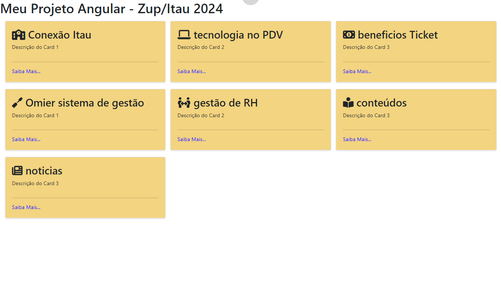
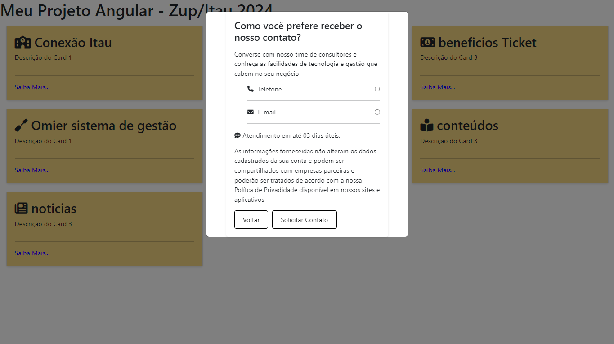

# Meu Projeto Angular 14.2.0

Este é um projeto Angular simples que apresenta uma lista de cards com um modal para solicitar contato.

## Entregaveis
- Cards
- Modal
- Test Unitarios
- DockerFile


## Como Executar

Siga estas instruções para executar o projeto localmente em sua máquina.

### Pré-requisitos

Certifique-se de ter o Node.js e o npm instalados em sua máquina.

- [Node.js](https://nodejs.org/)
- [npm](https://www.npmjs.com/)
- [ngx-bootstrap](https://www.npmjs.com/package/ngx-bootstrap?activeTab=readme#usage--demo)

### Instalação

1. Clone o repositório do GitHub:

```
git clone https://github.com/alexjosesilva/test-ZupInovation-FullStack.git
```

### Instalação

Navegue até o diretório do projeto:

```
cd seu-projeto
```

Instale as dependências do projeto:

```
npm install
```

### Execução
Após a instalação das dependências, você pode executar o projeto com o seguinte comando:

```
ng server
```

Isso iniciará o servidor de desenvolvimento e abrirá o aplicativo no seu navegador padrão. Você também pode acessar o aplicativo em http://localhost:4200.

### Contribuição

Se você quiser contribuir com este projeto, siga estas etapas:

1. Faça um fork do projeto
2. Crie uma nova branch (git checkout -b feature/sua-feature)
3. Faça commit de suas alterações (git commit -am 'Adicionar nova feature')
4. Faça push para a branch (git push origin feature/sua-feature)
5. Crie um novo Pull Request

### Licença

Este projeto está licenciado sob a Licença MIT - veja o arquivo LICENSE para detalhes.

```
Este README.md fornece todas as informações necessárias para executar, contribuir e entender a licença do projeto. Certifique-se de ajustar as seções conforme necessário para o seu projeto específico.
```

### Template do Projeto Front End

- Cards



- Modal

